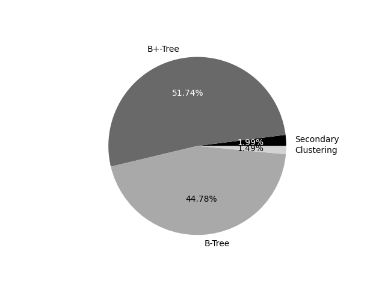
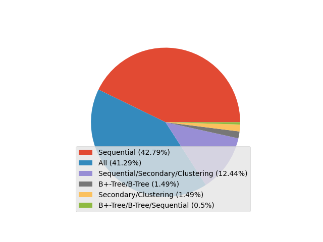

# DATA ANALYSIS RESULTS

## AVERAGE EXECUTION TIMES
1) B+-Tree: 719.5369351745037 ms  
2) B-Tree: 914.8397937434297 ms  
3) Secondary: 7203.132819180465 ms  
4) Clustering: 7475.2446241046655 ms  
5) Sequential: 84263.91315697438 ms  

### Percentages of each approach was the fastest to produce a result:  

## AVERAGE SCORES
1) Sequential: 0.898304428225348  
2) Clustering: 0.8768250618743398  
2) Secondary: 0.8768250618743398  
4) B+-Tree: 0.8285296726625021  
4) B-Tree: 0.8285296726625021  

* Note that clustering and secondary approaches always produced the same result, as did B+-tree and B-tree.
* Every approach was able to produce a perfect scored file for each test file.
* Observe the inverse relationship between the speed and score.

### Percentages of the highest scoring approach:
